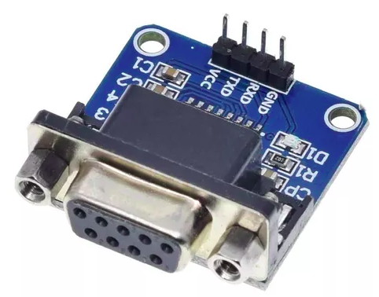
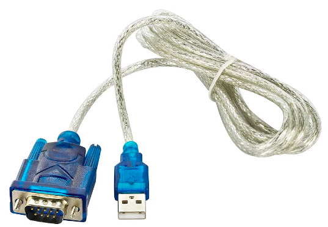
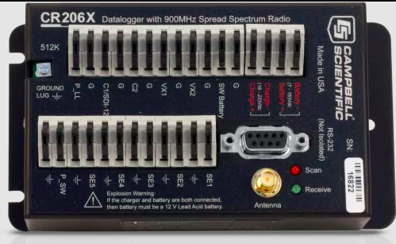
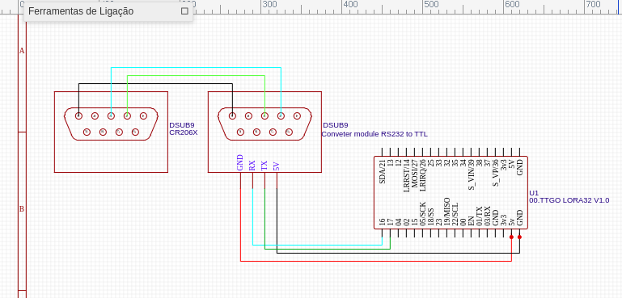
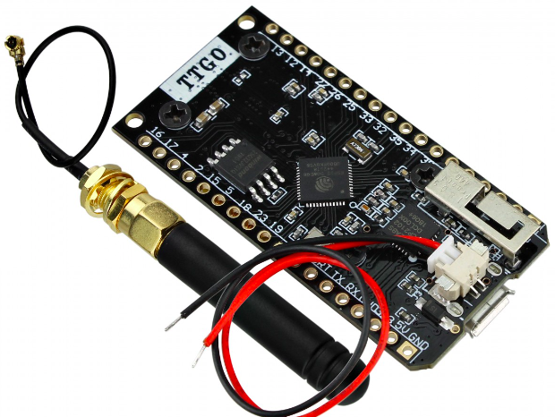
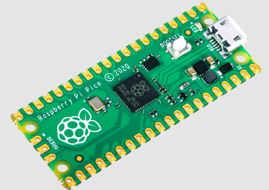

# CRBasic-CR206x

Repositório dedicado aos testes práticos com o Datalogger Campbell Scientific CR206x, usando scripts da linguagem de codificação CRBasic.

## Ambiente de Desenvolvimento

- Windows 10

- PC400 Support software

- Visual Studio Code

## Materiais

 **Módulo DB9 Conversor RS232 Serial TTL MAX232** |  **Cabo Conversor USB Serial RS232 DB9**
 ---               | ---
 | 

 ---

## Target

## Esquemático RS232 para TTL

## Microcontroladores

 **ESP32 LoRa TTGO SX1276** |  **Raspberry Pi Pico**
 ---               | ---
 | 

 ---
